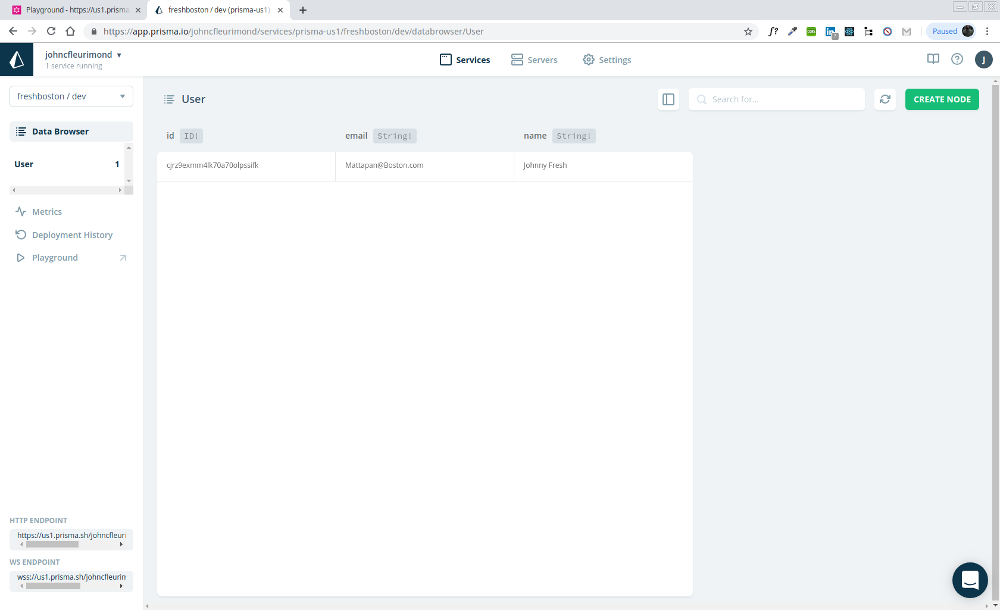
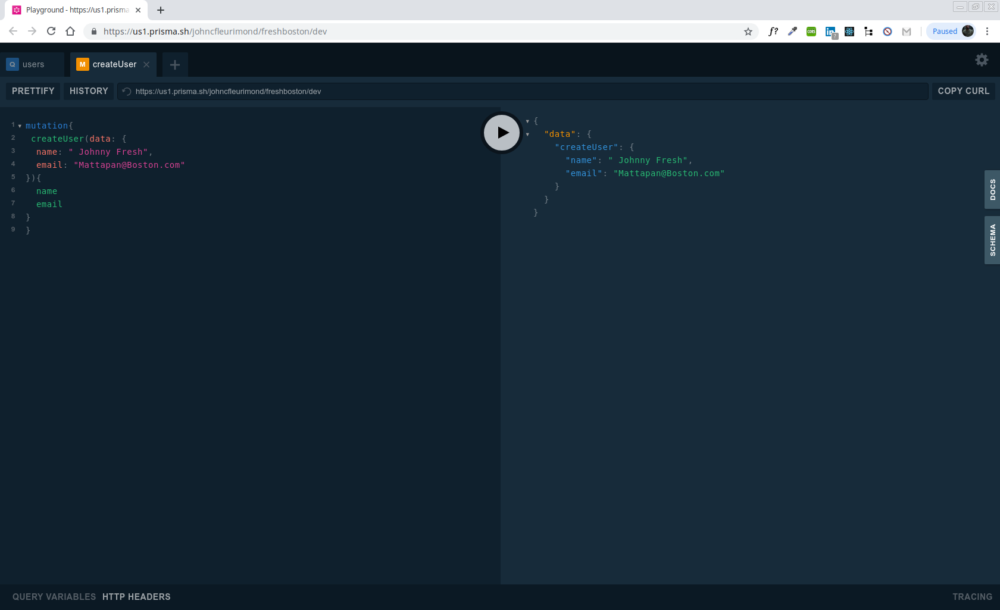
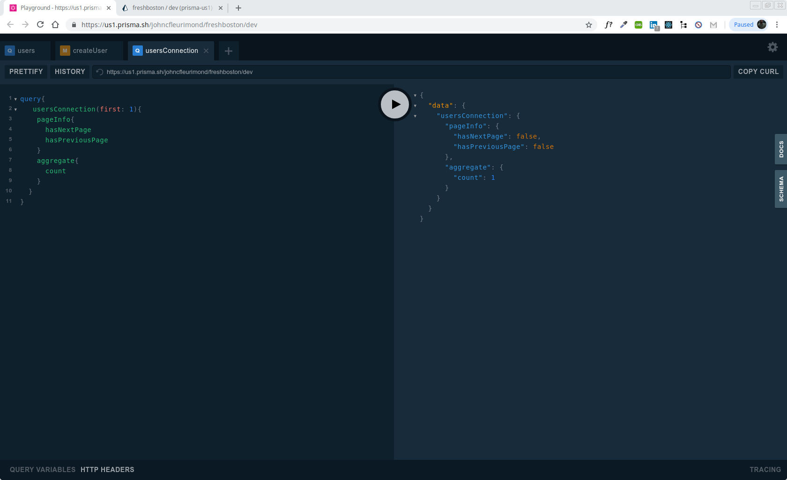

[](https://github.com/JOHNFLEURIMOND/ReactGraphQL)

# Advanced React & GraphQL


# My Awesome Project
This Is An Application That Shows Famous Black Inventors History To Celebrate Black History Month


## How It's Made
## Frontend
React.js for Building the interface along with Next.js for server side rendering, routing and tooling.

Apollo Client for data management. Performing GraphQL mutations, fetching GraphQL Queries, caching GraphQL data, managing local state, error and loading UI states.

{// THIS REPLACES THE NED FIR REDUX AND DATA FETCHING}

## Backend
GraphQL Yoda is an express GraphQL Server for implementating Query and mutation resolvers, custom Serverside logic, charging credit cards, sending email, performing authentication, and as well checking permissions.


Prisma is a GraphQL Database interface that provides a set of GraphQLCRUD API's for MySQL or Postgres Database, schema Definition, Data Relationships, Queried directly from Yoga Server, and Self Hosted.

## Lessons Learned:
In this tutorial I learned how to do more inline style in React, I rarely do it but Wes Bos has showed me some cool way to bring style via `injectGlobal` or style the components individually from styled-components.

```
injectGlobal`
  @font-face {
    font-family: 'radnika_next';
    src: url('/static/radnikanext-medium-webfont.woff2') format('woff2');
    font-weight: normal;
    font-style: normal;
  }

  body {
    padding: 0;
    margin: 0;
    font-size: 1.5rem;
    line-height: 2;
    font-family: 'radnika_next';
  }
```

or


## import styled, { ThemeProvider, injectGlobal } from 'styled-components';


```
const SearchStyles = styled.div`
  position: relative;
  input {
    width: 100%;
    padding: 10px;
    border: 0;
    font-size: 2rem;
    &.loading {
      animation: ${glow} 0.5s ease-in-out infinite alternate;
    }
  }
`;

export { DropDown, DropDownItem, SearchStyles };


```

I am getting better with running both servers and troubleshooting the errors I have been receiving in the terminal. Most of the beginning chapters up to nine I already knew about Next but for the most part, its been a while since I used `<router/>` by Next.

`import NProgress from 'nprogress';` was something cool and new I never heard of. NProgress.js is a nanoscopic progress bar, with this realistic trickle slim progress bars made perfect for Ajax'y applications, displays a animation of a loading bar to tell your users that something's happening, inspired by Google, YouTube, and Medium.

Easy Install and easy implementation:

```

import NProgress from 'nprogress';

Router.onRouteChangeStart = () => {
  NProgress.start();
};

Router.onRouteChangeComplete = () => {
  NProgress.done();
};

Router.onRouteChangeError = () => {
  NProgress.done();
};

```

Setting up Prisma was not easy I had ran into a lot of issues with not finding `prisma` as a command and troubleshooting this issue took up post of my time and finding out my $PATH was not correct. I got some help in slack to config `/bin` and seeing where certain files are in `node_modules`, the person that helped me, Mark, thinks my node setup might be a little off because I've been running sudo with npm. When I start doing that it can change permissions on important files to root, which means that after that happens I don't have access to those files anymore under my own user account.

Once we corrected all that Prisma was perfect. I had a `variables.env` that personal information and keys that I didn't want the public to be like endpoints and such. Onced I config that, I learned that `prisma deploy` wouldn't work and I had to pass a custom path and had to `prisma deploy --env-file variables.env` Once I deployed it I got a fast message saying the types it shows the types I created and the type of String. I can see the actual database that I created, the users and emails I passed thru as well. They even have a link in the terminal that GraphQL Database endpoints,in that link has a GraphQL playground that shows you different Queries you can run like so:


```

  User (Type)
  + Created type `User`
  + Created field `id` of type `ID!`
  + Created field `name` of type `String!`
  + Created field `updatedAt` of type `DateTime!`
  + Created field `createdAt` of type `DateTime!`
```


[](https://github.com/JOHNFLEURIMOND/ReactGraphQL)
[](https://github.com/JOHNFLEURIMOND/ReactGraphQL)
[](https://github.com/JOHNFLEURIMOND/ReactGraphQL)

After all this I started on the GraphQL server side. So I started my created my database in a variable, made a function called createServer which will ingest a schema.graphql and it will match up everything in the schema with resolvers out of a mutations or query. ( Query resolvers have to do with pulling data and mutations resolvers have to do with pushing data.)

Then in the index.js, I brought in my variables for env, db and createServer. I have MIDDLEWARE to Install but thats on hold. So I can start my server script which is ran by Nodemon. 


## GITHUB PULL REQUEST, Branching, Merging & Team Workflow

I also getting better with the git commands and doing `git checkout -b NewBranch` and making my changes in a separate branch and add all the changes there then switching to the master than merging it. Got used to git pull from changes on the master that the other branches didn't have and troubleshooting most of the errors.


## Optimizations.
I have to get  GraphQL going on the client side. I would Like to add concurrently, which is a NPM package that allows you to run two scripts at once.

## Available Scripts

Once you clone this repo, `cd` In the project directory for the frontend and backend, you can run:

## Installation

2. run `npm install` and ` npm audit fix ` if any fixes needed.

## Usage

3. run `npm run dev`


## Learn More


## portfolio:

**WEBSITE:** https:johnfleurimond.com


## Happy Coding!!!!
