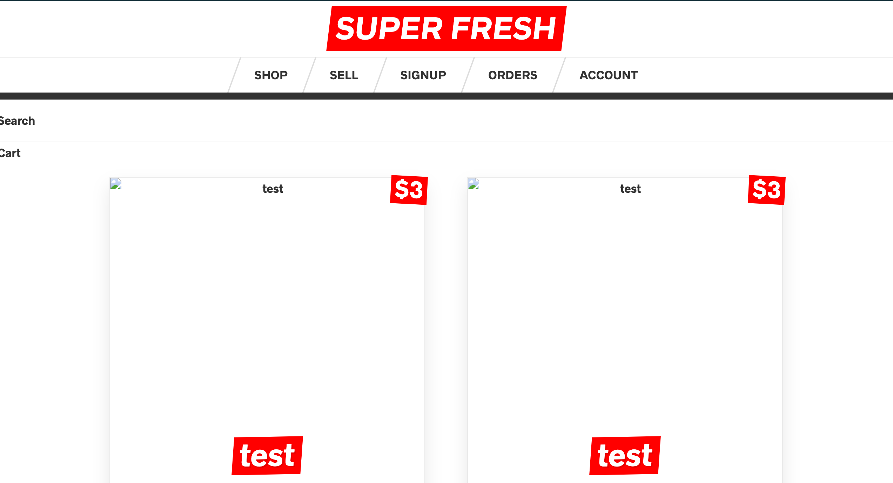

# Advanced React & GraphQL

# My Awesome Project
This Is An Application That Shows Famous Black Inventors History To Celebrate Black History Month

## How It's Made
## Frontend
React.js for Building the interface along with Next.js for server side rendering, routing and tooling.

Apollo Client for data management. Performing GraphQL mutations, fetching GraphQL Queries, caching GraphQL data, managing local state, error and loading UI states.

{// THIS REPLACES THE NED FIR REDUX AND DATA FETCHING}

## Backend
GraphQL Yoda is an express GraphQL Server for implementating Query and mutation resolvers, custom Serverside logic, charging credit cards, sending email, performing authentication, and as well checking permissions.

Prisma is a GraphQL Database interface that provides a set of GraphQLCRUD API's for MySQL or Postgres Database, schema Definition, Data Relationships, Queried directly from Yoga Server, and Self Hosted.

## Lessons Learned:

## Optimizations.

## Available Scripts

 Once you clone this repo, `cd` In the project directory for the frontend and backend, you can run:

## Installation

2. run `npm install` and ` npm audit fix ` if any fixes needed.

## Usage

3. run `npm run server`

## Learn More

## portfolio:

**WEBSITE:** https:johnfleurimond.com

## Happy Coding!!!!
